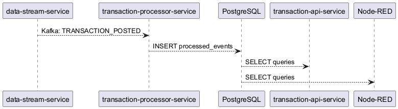
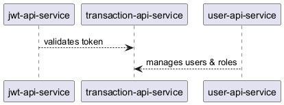

# How I Think About Architecture

## Working Prototypes, Not Static Diagrams

---

## The Problem

Most architects work like this:

1. Open Draw.io or Visio
2. Draw boxes and arrows
3. Write a long document
4. Hand it over to developers
5. Developers guess what it means
6. Implementation is wrong
7. Rework

I work differently.

---

## My Approach

> **Build a working prototype first. Then hand it over.**

Tools I use:

- **Node-RED** — visual programming, running prototype
- **Hurl** — executable tests (same tests for prototype and real code)
- **k6** — load testing from day one
- **Docker** — everything runs with one command

---

## A Practical Example

Let's imagine a company called **Transacto**.

They have some services already running:

- **data-stream-service** — sends banking events to Kafka
- **jwt-api-service** — user login and tokens
- **transaction-processor-service** — reads events, saves to database

They ask me: *"Design a new REST API for transactions and accounts."*

This is how I did it.

---

## System Overview



And for security:



---

## Understanding the Existing System

Before designing the new API, I needed to understand how the existing services work.

I created two Node-RED flows to explore them:

- **"JWT Auth API"** — login, register, refresh tokens
- **"User Service"** — create, read, update, delete users

This helped me understand the authentication flow, data models, and API patterns. Then I started designing the prototype.

---

## Step 1: Build a Prototype in Node-RED

Instead of drawing diagrams, I opened Node-RED and built the API.

A running prototype is better because:

- Developers can test it immediately
- Business people can see it working
- We find problems before writing code
- Changes take seconds, not days

---

### Tab: Transacto Dashboard


The main view. Shows all services and their health status. One click to check everything.

---

### Tab: JWT Auth API


Login, register, refresh tokens. Every API call needs a valid token.

---

### Tab: User Service


Create, read, update, delete users. Admins have more rights.

---

### Tab: Transaction API Prototype


The new service I designed. Endpoints:

- `GET /health` — is the service running?
- `GET /api/stats` — how many events and accounts?
- `GET /api/transactions` — list transactions
- `GET /api/transactions/:id` — one transaction
- `GET /api/accounts` — list accounts
- `GET /api/accounts/:id` — one account

---


### Tab: Performance Tests


I included load testing from the start. k6 tests:

- **Smoke** — 1 user, basic check
- **Load** — 50 users, normal traffic
- **Stress** — 300 users, find the limit

---

### Tab: Regression Tests


I wrote executable tests with Hurl. The same tests check both:
1. The Node-RED prototype
2. The real implementation

If the tests pass, the implementation is correct. No guessing.

---

### Tab: Canary Monitoring


This shows another use of Node-RED. It mimics **AWS Canary** — a service that checks if systems are healthy.

Every 60 seconds it checks all services. If one is down, it sends an alert (mock email and SMS). It waits 5 minutes before the next alert so you don't get spammed.

This is the kind of tool you would run in AWS alongside your services.

---


## The Key Difference

| How most architects work | How I work |
|-------------------------|-----------|
| Draw static diagrams | Build a running prototype |
| Write a specification | Write executable tests |
| Hand over documents | Hand over a working system |
| Changes are slow | Change the flow, click deploy |
| Ambiguity and rework | Tests pass = correct |

---

## Why This Matters

When you hire an architect, you want someone who:

- Reduces risk — prototype finds problems early
- Saves time — no back and forth between diagram and code
- Makes things clear — running code is better than a PDF
- Has a "change mindset" — always looking for better ways

This project shows exactly that.

---

## Try It Yourself

```sh
git clone https://github.com/4arturas/transacto.git
cd transacto
docker compose up --build
```

Two web UIs are included:

- **http://localhost:4000** — Transaction monitoring dashboard (accounts, transactions, stats)
- **http://localhost:3100** — Admin panel (manage users, roles)

Hardcoded demo credentials:

| Role | Email | Password |
|------|-------|----------|
| Admin | `admin@example.com` | `admin123` |
| Regular user | `alice@example.com` | `secret123` |

Other endpoints:

- **http://localhost:1880** — Node-RED flow editor
- **http://localhost:3000** — JWT Auth API (JSON only)

Run the tests:

```sh
# Functional tests (Hurl)
hurl --test --file-root . tests/regression/user-service-tests/run-all.hurl
hurl --test --file-root . tests/regression/jwt-api-service-tests/run-all.hurl
hurl --test --file-root . tests/regression/transaction-api-service-tests/run-all.hurl

# Performance tests (k6)
k6 run tests/performance/user-service-load.js
k6 run tests/performance/jwt-api-load.js
k6 run tests/performance/transaction-api-load.js
```

---

## Thank You

Repository: https://github.com/4arturas/transacto
