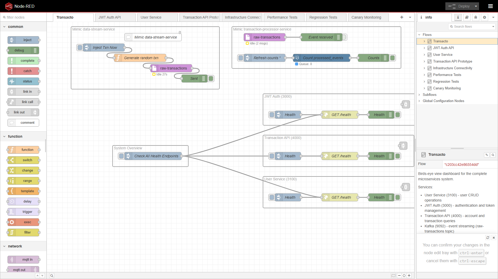
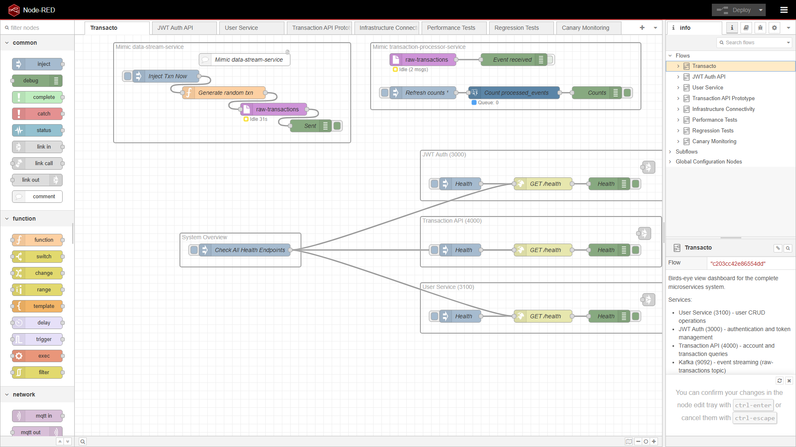
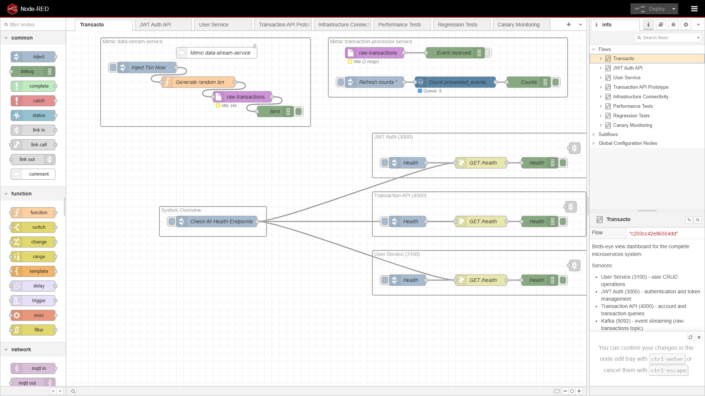
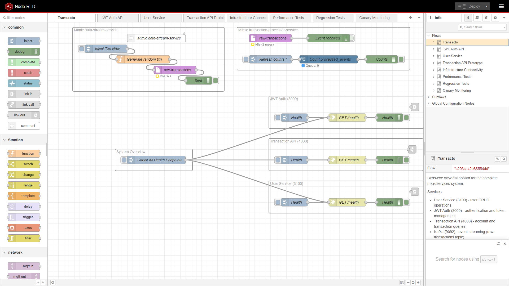
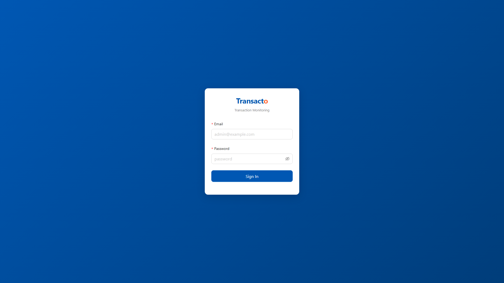
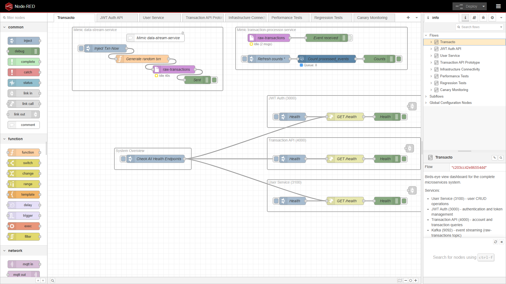
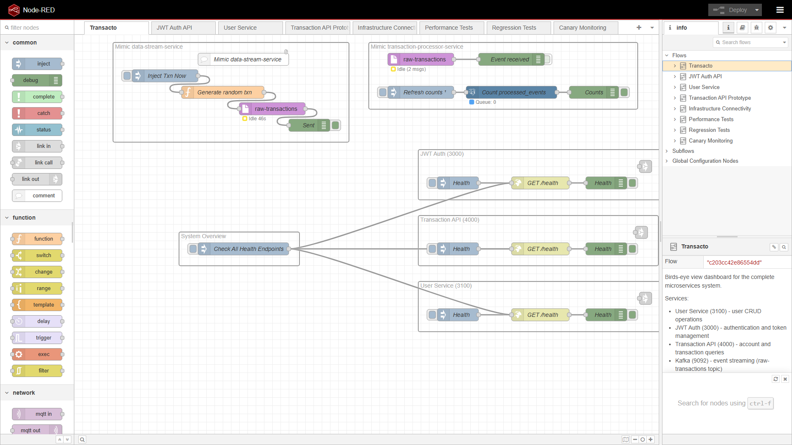
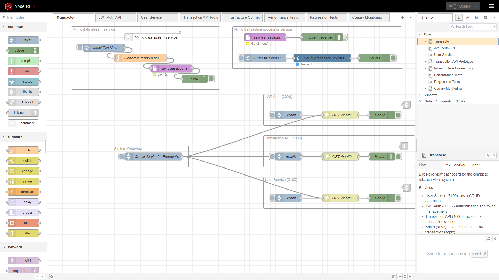

# The Ledger Bridge

## Event-Driven Microservices Architecture — A Working Prototype

---

**Transacto** · Core Banking System Modernization

---

## About Me

- Software developer transitioning to **Software Architect**
- Belief: **Working prototypes > static diagrams**
- Tools: Node-RED · Kafka · PostgreSQL · Docker · TypeScript · k6 · Hurl

> *"Most architects hand over diagrams and a spec. I hand over a running prototype that the developer can curl, with the same tests that will validate their implementation."*

---

## The Problem

Danske Bank's Digital Core tribe is modernizing legacy banking systems.

Traditional architect handoff:

```
Draw.io diagram → developer interprets → implementation drift → rework
```

My approach:

```
Node-RED prototype → developer runs → self-validating tests → done
```

---

## System Architecture

```
┌─────────────────────┐     ┌──────────────────────┐
│   data-stream-      │────▶│   transaction-        │
│   service           │     │   processor-service   │
│   (Kafka Producer)  │     │   (Kafka Consumer)    │
└─────────────────────┘     └───────┬──────────────┘
                                    │
                                    ▼
┌─────────────────────┐     ┌──────────────────────┐
│   jwt-api-service   │     │   transaction-api-    │
│   (Auth: 3000)      │     │   service (API: 4000) │
└─────────────────────┘     └──────────────────────┘
                                    │
                                    ▼
┌─────────────────────┐     ┌──────────────────────┐
│   user-api-service   │     │   Node-RED            │
│   (Admin: 3100)     │     │   (Prototype: 1880)   │
└─────────────────────┘     └──────────────────────┘
```

**Infrastructure:** Kafka (event streaming) · PostgreSQL (persistence) · Docker (containerization)

---

## Node-RED: Executable Architecture

Node-RED replaces static diagrams with **running prototypes**.

| Flow Tab | Purpose |
|----------|---------|
| **Transacto** | Birds-eye dashboard — health checks for all services |
| **JWT Auth API** | Authentication endpoints (login, register, refresh) |
| **User Service** | User CRUD operations |
| **Transaction API Prototype** | Transaction & account query API |
| **Infrastructure Connectivity** | Kafka + PostgreSQL connectivity tests |
| **Performance Tests** | k6 load test triggers |
| **Regression Tests** | Hurl test suite runner |
| **Canary Monitoring** | Per-service health monitoring with alerts |

---

## Transacto Dashboard



Health check dashboard for all services with navigation links.

---

## JWT Auth API Flow



Login → save token → refresh → verify identity. Ready for developer implementation.

---

## User Service Flow



Full CRUD: create, read, update role, delete. Admin and regular user paths.

---

## Transaction API Prototype



The prototype that developers will implement: health, stats, transactions, accounts.

---

## Transaction API UI



The implemented service — live data from PostgreSQL, accessible at port 4000.

---

## Infrastructure Connectivity



Kafka consumer and PostgreSQL queries — verifying the infrastructure works end-to-end.

---

## Performance Tests


k6 integration in Node-RED for smoke, load, and stress testing.

---

## Regression Tests



Hurl executable specification — the same tests validate both the prototype AND the real implementation.

---

## Canary Monitoring



Per-service health checks with cooldown and mock email/SMS alerts.

---

## Testing Strategy

### Executable Specification (Hurl)

```sh
hurl --test --file-root . tests/regression/transaction-api-service-tests/run-all.hurl
```

> Same tests pass against Node-RED prototype AND real implementation.

### Performance Testing (k6)

| Test | What it does |
|------|-------------|
| Smoke | 1 VU, 1 iteration — verify basic functionality |
| Load | Ramp to 50 VUs — expected traffic |
| Stress | Ramp to 300 VUs — find breaking point |

---

## Key Differentiators

| Traditional Architect | My Approach |
|----------------------|-------------|
| Draw.io / PDF diagrams | **Node-RED running prototype** |
| Written specification | **Executable Hurl tests** |
| Handoff → implementation → rework | **Prototype → validate → implement** |
| Static architecture | **Event-driven, observable, testable** |

---

## Why This Matters for Danske Bank

- **Change mindset:** Working prototypes reduce ambiguity and accelerate delivery
- **Event-driven:** Kafka-native architecture aligns with Digital Core's direction
- **Testable contracts:** Developers implement until the Hurl tests pass — no guesswork
- **Cloud-native:** Docker containers, Kubernetes-ready, microservices

---

## Try It Yourself

```sh
git clone https://github.com/4arturas/transacto.git
docker compose up --build
```

Then open:
- **http://localhost:1880** — Node-RED editor (all flows)
- **http://localhost:4000** — Transaction API UI
- **http://localhost:3000** — JWT Auth API
- **http://localhost:3100** — User Service API

---

*Built with Node-RED · TypeScript · Kafka · PostgreSQL · Docker · k6 · Hurl*
